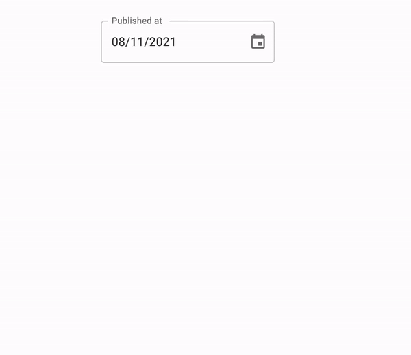

# `<DateInput>`

Ideal for editing dates, `<DateInput>` renders an HTML `<input type="date">` element, that most browsers display as a  [date picker](https://developer.mozilla.org/en-US/docs/Web/HTML/Element/input/date).


The appearance of `<DateInput>` depends on the browser, and falls back to a text input on Safari. The date formatting in this input depends on the user's locale.

## Usage

```jsx
import { DateInput } from 'react-admin';

<DateInput source="published_at" />
```

The field value must be a string with the pattern `YYYY-MM-DD` (ISO 8601), e.g. `'2022-04-30'`.

## Props

`<DateInput>` accepts the [common input props](./Inputs.md#common-input-props).

## Validation

To validate that a date is before or after a given date, use the `maxValue` and `minValue` validators with a date string.

```jsx
import { DateInput, minValue } from 'react-admin';

// requires dates after October 10th, 2022
<DateInput source="published" validate={minValue('2022-10-26')} />
```

## Internationalization

It is not possible to customize the date format. Browsers use the user locale to display the date in the correct format.

If you need to render a UI despite the browser locale, MUI also proposes a [Date Picker](https://mui.com/components/pickers/#date-pickers) component, which is more customizable than the native date picker, but requires additional packages.


