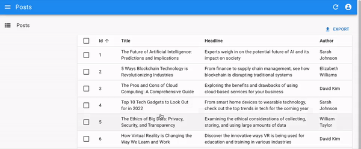

# `useLockOnMount`

This [Enterprise Edition](https://marmelab.com/ra-enterprise) hook locks the current record on mount.

`useLockOnMount` calls `dataProvider.lock()` on mount and `dataProvider.unlock()` on unmount to lock and unlock the record. It relies on `authProvider.getIdentity()` to get the identity of the current user. It guesses the current `resource` and `recordId` from the context (or the route) if not provided.



## Usage

Use this hook e.g. in an `<Edit>` component to lock the record so that it only accepts updates from the current user.

```jsx
import { Edit, SimpleForm, TextInput } from 'react-admin';
import { useLockOnMount } from '@react-admin/ra-realtime';
import { Alert, AlertTitle, Box } from '@material-ui/core';

const PostAside = () => {
    const { isLocked, error, isLoading } = useLockOnMount();
    return (
        <Box width={200} ml={1}>
            {isLoading && <Alert severity="info">Locking post...</Alert>}
            {error && (
                <Alert severity="warning">
                    <AlertTitle>Failed to lock</AlertTitle>Someone else is
                    probably already locking it.
                </Alert>
            )}
            {isLocked && (
                <Alert severity="success">
                    <AlertTitle>Post locked</AlertTitle> Only you can edit it.
                </Alert>
            )}
        </Box>
    );
};

const PostEdit = () => (
    <Edit aside={<PostAside />}>
        <SimpleForm>
            <TextInput source="title" fullWidth />
            <TextInput source="headline" fullWidth multiline />
            <TextInput source="author" fullWidth />
        </SimpleForm>
    </Edit>
);
```

## Parameters

`useLockOnMount` accepts a single options parameter, with the following properties (all optional):

-   `identity`: An identifier (string or number) corresponding to the identity of the locker (e.g. `'julien'`). This could be an authentication token for instance. Falls back to the identifier of the identity returned by the `AuthProvider.getIdentity()` function.
-   `resource`: The resource name (e.g. `'posts'`). The hook uses the `ResourceContext` if not provided.
-   `id`: The record id (e.g. `123`). The hook uses the `RecordContext` if not provided.
-   `meta`: An object that will be forwarded to the `dataProvider.lock()` call
-   `lockMutationOptions`: `react-query` mutation options, used to customize the lock side-effects for instance
-   `unlockMutationOptions`: `react-query` mutation options, used to customize the unlock side-effects for instance

You can call `useLockOnMount` with no parameter, and it will guess the resource and record id from the context (or the route):

```jsx
const { isLocked, error, isLoading } = useLockOnMount();
```

Or you can provide them explicitly:

```jsx
const { isLocked, error, isLoading } = useLockOnMount({
    resource: 'venues',
    id: 123,
    identity: 'John Doe',
});
```

**Tip**: If the record can't be locked because another user is already locking it, you can use [`react-query`'s retry feature](https://react-query-v3.tanstack.com/guides/mutations#retry) to try again later:

```jsx
const { isLocked, error, isLoading } = useLockOnMount({
    lockMutationOptions: {
        // retry every 5 seconds, until the lock is acquired
        retry: true,
        retryDelay: 5000,
    },
});
```
